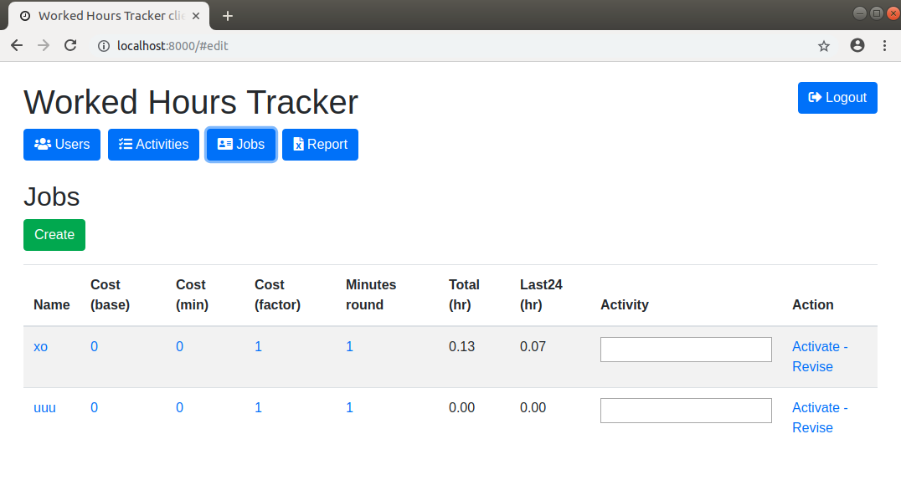
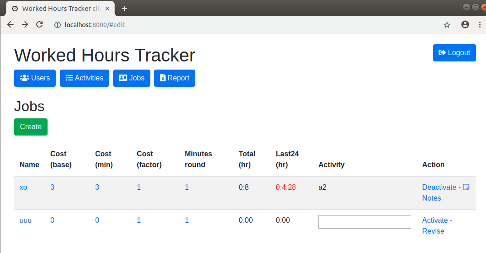

# worked-hours-tracker

web tracker of worked hours

## features

- admin access to create user, edit contacts, set user work cost, download report
- user access to toggle work, download report own hours

## install

- first run generate follow error message

```
please configure [/home/devel0/.config/workedhourstracker/config.json] setting DBHostname, DBPort, DBName, DBUsername, DBPassword (see README.md)
```

file appears like follow

```
{
  "DBHostname": "hostname",
  "DBPort": 5432,
  "DBName": "worked_hours_tracker",
  "DBUsername": "postgres",
  "DBPassword": "pass",  
}
```

- create an empty db from postgres
- open `~/.config/workedhourstracker/config.json` and set parameters accordingly to your postgres db
- create tables using

```sh
cd WorkedHoursTrackerWebapi
dotnet ef migrations add migr1
dotnet ef database update
```

## screenshoots

### admin functions

**User view**


**User edit**


**Job list**



**Worked hours report**


### all users

**Job list**



**Job work notes**


## how this project was created

```sh
dotnet new webapi --name=WorkedHoursTrackerWebapi
cd WorkedHoursTrackerWebapi
dotnet add package Npgsql.EntityFrameworkCore.PostgreSQL --version 2.1.2
dotnet add package Microsoft.EntityFrameworkCore.Relational --version 2.1.3
dotnet ef migrations add migr1
dotnet ef database update
cd ..

mkdir WorkedHoursTrackerClient
cd WorkedHoursTrackerClient
bower init
```

## debugging

- install local web server `npm install -g local-web-server`

- start local web server for client and launch Visual Studio code on both projects

```
cd WorkedHoursTrackerClient
ws -p 8000 --spa index.html &
code .
cd ..

cd WorkedHoursTrackerWebapi
code .
```

- start (F5) webapi
- start (F5) client ( require vscode chrome debugger extension )
