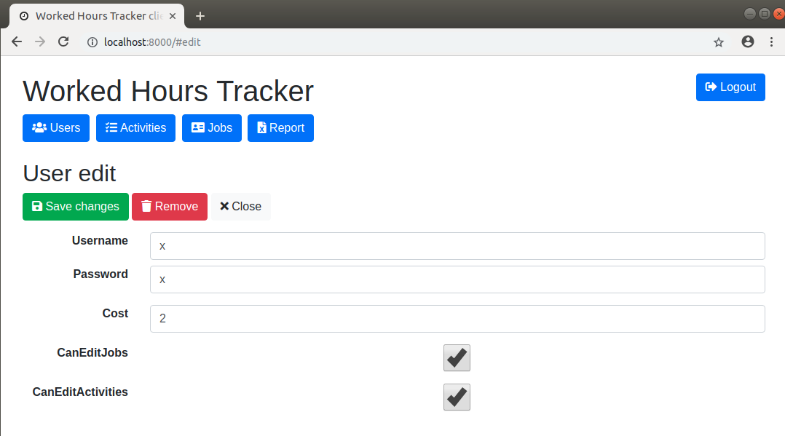
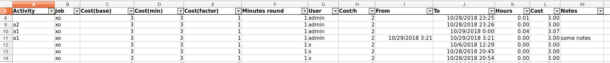

# worked-hours-tracker

web tracker of worked hours

## features

- admin
  - create user
  - edit job
  - download report
- activities
- user
  - toggle work by specifying an associated activity
  - notes can be inserted when job toggled on and will reported in the report
- [user](WorkedHoursTrackerWebapi/Types/User.cs) properties
  - cost ( hour cost )
- [job](WorkedHoursTrackerWebapi/Types/Job.cs) properties
  - base_cost
  - min_cost
  - cost_factor
  - minutes_round
  
- work cost computed by Cost() function of [Job](WorkedHoursTrackerWebapi/Types/Job.cs), written into xlsx as formula, as follow

```
Max(base_cost + (hours * 60).MRound(minutes_round) / 60 * hourCost * cost_factor, min_cost)
```

## roadmap (TODO)

- pause/resume function ( to avoid a base_cost if deactivate/activate again )

## install (docker)

- tune `docker/config.json` for an existing db connection name ( just create an empty database in some postgres server db )

```sh
cd docker
./build.sh
```

- if default docker network restricted ( 80, 443 are used to install bower and nuget packages ) run `./build --network=build` where `build` is a network without specific outgoing restrictions

```sh
./run.sh
```

- configure nginx [example](https://github.com/devel0/knowledge/blob/master/doc/nginx-webapi-conf.md)

## development

- first run generate follow error message

```
please configure [/home/devel0/.config/workedhourstracker/config.json] setting DBHostname, DBPort, DBName, DBUsername, DBPassword (see README.md)
```

file appears like follow

```
{
  "DBHostname": "hostname",
  "DBPort": 5432,
  "DBName": "worked_hours_tracker",
  "DBUsername": "postgres",
  "DBPassword": "pass",  
}
```

- create an empty db from postgres
- open `~/.config/workedhourstracker/config.json` and set parameters accordingly to your postgres db
- create tables using

```sh
cd WorkedHoursTrackerWebapi
dotnet ef migrations add migr1
dotnet ef database update
```

## screenshoots

### admin functions

**User view**


**Activities view**


**Activities edit**

**User edit**



**Job list**


**Worked hours report**




### all users

**Job list**


**Job work notes**


## how this project was created

```sh
dotnet new webapi --name=WorkedHoursTrackerWebapi
cd WorkedHoursTrackerWebapi
dotnet add package Npgsql.EntityFrameworkCore.PostgreSQL --version 2.1.2
dotnet add package Microsoft.EntityFrameworkCore.Relational --version 2.1.3
dotnet ef migrations add migr1
dotnet ef database update
cd ..

mkdir WorkedHoursTrackerClient
cd WorkedHoursTrackerClient
bower init
```

## debugging

- install local web server `npm install -g local-web-server`

- start local web server for client and launch Visual Studio code on both projects

```
cd WorkedHoursTrackerClient
ws -p 8000 --spa index.html &
code .
cd ..

cd WorkedHoursTrackerWebapi
code .
```

- start (F5) webapi
- start (F5) client ( require vscode chrome debugger extension )
